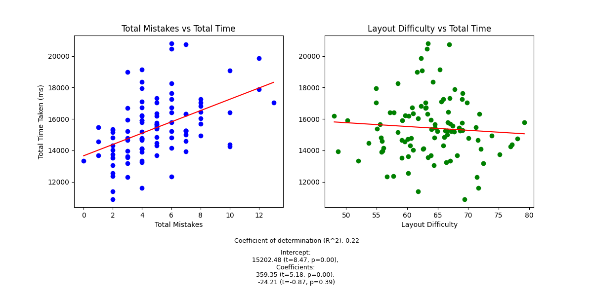

# 26quick

###### Table of contents

* [Intro](#intro)
* [Instructions](#instructions)
* [Insights](#insights)
* [Direction](#direction)

### Intro

26quick is a passion project, a way for me to learn front-end web development and statistical data analysis in an applied setting, and a way to research learning in humans in order to answer some questions that genuinely interest me. It's also a video game and I've always wanted to make one of those. The idea is to collect data in a simple setting over long time horizons to analyze how various practice parameters affect learning (see [the direction section](#direction) for more detail).

It's modeled off a game I used to play on my phone where you simply had to tap the numbers one through twenty-five as quickly as possible. They were arranged in a square grid and it was much easier than my keyboard adaptation. I played something like 8,000 8-12s runs of that game before growing bored, and went from sub-10s runs feeling like NASCAR to a 5.5s personal best through ~20 hours of practice in spare moments throughout my day. The reason I was drawn to the game as a model for my own project is that it has a very high difficulty : complexity ratio, making it an effective magnifying glass for factor analysis. The random element of the number distribution contributes to the skill curve lengthening and enables the design simplicity, while the short run time means higher sample sizes.
 
### Instructions

To play the game, either download the files from this repo and unzip directly, or clone the repo if you have the technical expertise. Once you have the folder, locate and open the index.html file with your browser. Most of the time this can be done simply by double clicking it. You should be met with an introductory banner, a left and right panel, and a play area with the on-screen keyboard.

The panels can be flipped over by clicking the info icons to reveal details. The left panel is used for managing and downloading your browser data and the right for preliminary analysis.

Once you've played the game for a while and want to further analyze your data, complete the following steps:
1) Click the "Download Local Storage" button and a file named "localStorage_YYYY-MM-DD_HH-MM-SS.json" will be downloaded.
2) Now, create a folder under the "data" directory with a name beginning with "session_" (a number following this string would be most natural of course). See example called "session_n".
3) Place the downloaded .json file into this folder.
4) Edit the file "generate_session_data.py" to include the correct .json filename and output folder path. The paths are currently configured to work in the "session_n" example directory. You can run the script as-is to generate analyses for the example session.
  * 
5) Before you can run the analyses, you'll need to install the necessary Python packages by running the following command in the project directory: pip install -r requirements.txt
6) Finally, run the "generate_session_data.py" script and your session directory should be populated with 4 additional files and a folder called "lm":
  * **performance_plot.png**: a simple visualization, with time and mistakes plotted on parallel y-axes
  * **raw_YYYY-MM-DD_HH-MM-SS.csv**: a csv file in which rows describe in-game events, like key presses and releases or the starts and ends of runs
  * **session_YYYY-MM-DD_HH-MM-SS.csv**: a .csv file in which rows describe full runs
  * **summary_YYYY-MM-DD_HH-MM-SS.txt**: a .txt file giving summary statistics for the whole session
  * **lm**: a folder containing a summary and scatter plot of a one-factor (Total Mistakes) linear model fit to your session data

Note: "raw_to_session(...)" has a third parameter called "outlier_threshhold" you can add to the function call in line 186 if needed. It imposes a maximum time and mistakes: if either is exceeded, the run will not be added to "session_YYYY-MM-DD_HH-MM-SS.csv". Useful for when a friend hops in for a few runs.

### Insights

Session 1: two insights have been drawn from a two-factor linear model fit to one set of session data (n=100).
* Mistakes correlates highly with time taken (p≈0). The more mistakes you make, the worse your time. It's very tempting to try to go quick, since the time is intuitively the primary measure of skill, but you will actually be faster on average if you focus on making fewer mistakes, instead of focusing on pressing the buttons faster.
* Layout difficultly plays a very small role in determining time taken, if any (p≈.36). Often while playing I notice strings of consecutive numbers which are adjacent or close to each other, enabling me to find and press them very quickly. Conversely, numbers that are further away from the one I just pressed feel like they take longer to find and press. I expected layout difficulty, assessed by the average distance between two consecutive keys within a run, to be a major predictor of time taken, but it turns out not to be the case. This is likely due to the relatively low layout difficulty standard deviation. Because there are so many numbers, the average distance between keys for a run turns out to be very similar from run to run (sd=6.26mm).
* 

### Direction

By its nature this is a very expandable project, and something of a perpetual work-in-progress. The data analysis is currently preliminary and small in scale (limited to a single session), so concrete goals for the future of this project include:
* **Data collection**: This is the fun part. To take advantage of the aforementioned long skill curve and conducivity to large samples, I'll of course have to generate these samples by playing the game.
* **Research questions**:
  - *Microscopic*
      + How are these factors related?
        - target key absolute location and time to press
        - target key number and time to press
        - target key absolute location and mistake probability
        - target key number and mistake probability
        - target key relative location (to last key) and time to press
        - target key relative location (to last key) and mistake probability
      + Does hiding mistakes and time during practice improve or hurt performance?
  - *Macroscopic*
      + How long does it take to "warm up"? I'll take a rolling average over many sessions and identify peak performance window.
      + Is there a benefit to taking short breaks in the middle of a session?
      + How quickly do I get better? Can the skill curve be fit well to a mathematical model (exponential decay, power law, etc.)?
      + Does sleep noticably improve performance? More than a break of equal time?
* **More subjects**: Obviously any trends I identify in my own performance would benefit corroberation. Also would eventually like to look at inter-subject variability.
* **Web hosting**: To that end, hosting the game online for data collection purposes is an obvious possibility, but one which I am somewhat cautious about for the time being because of all the extraneous legwork involved, and how much further I can take the project before I need to go there.
