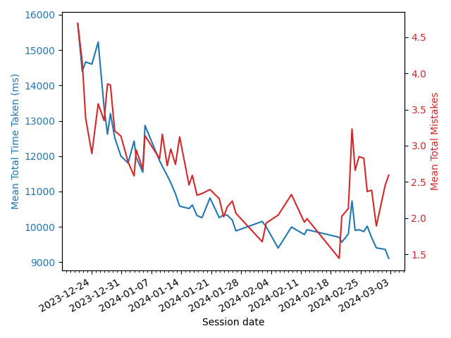
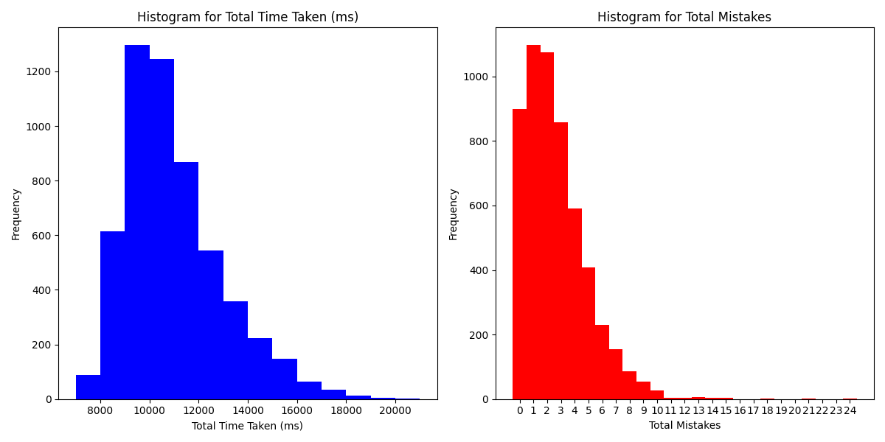
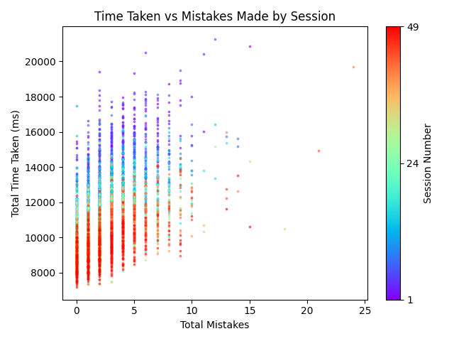
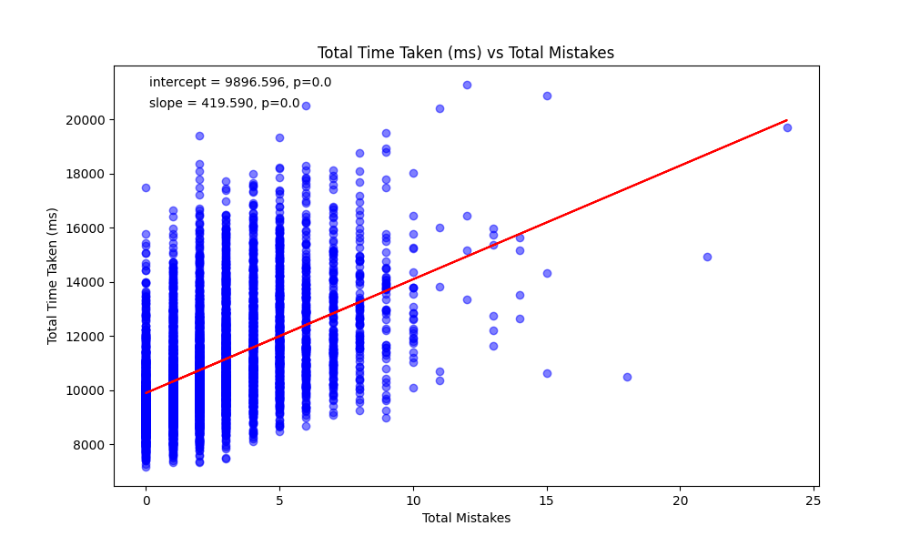
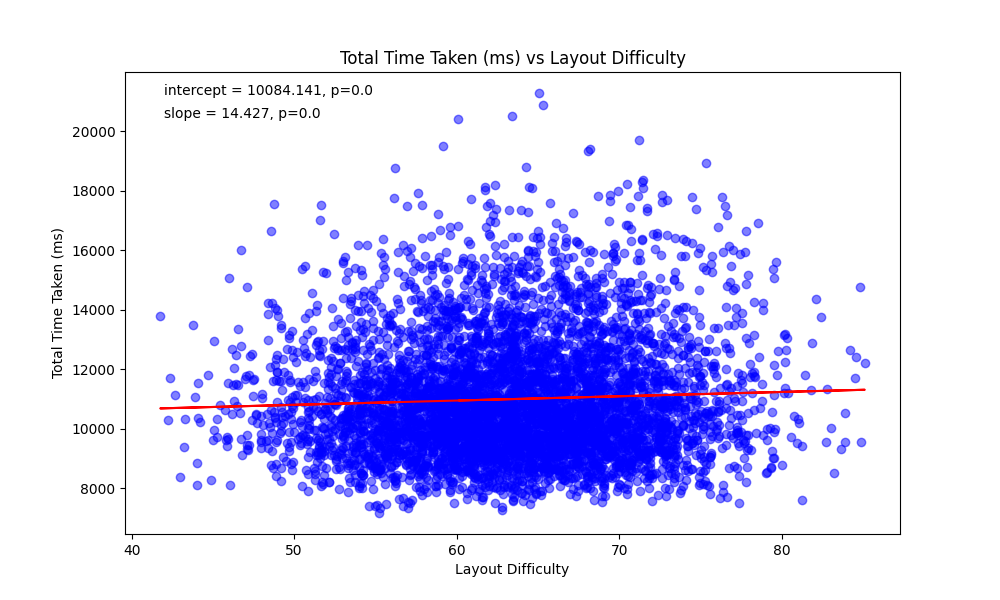

# 26quick

###### Table of contents

* [Intro](#intro)
* [Instructions](#instructions)
* [Insights](#insights)
* [Direction](#direction)

### Intro

26quick is a passion project, a way for me to learn front-end web development and statistical data analysis in an applied setting, and a way to research learning in humans in order to answer some questions that genuinely interest me. It's also a video game and I've always wanted to make one of those. The idea is to collect data in a simple setting over long time horizons to analyze how various practice parameters affect learning (see [the direction section](#direction) for more detail).

It's modeled off a game I used to play on my phone where your task was simply to tap the numbers one through twenty-five, arranged in a 5-by-5 grid, as quickly as possible. I played something like 8,000 8-12s runs of that game before growing bored, and went from sub-10s runs feeling like NASCAR to a 5.5s personal best through ~20 hours of practice in spare moments throughout my day. The reason I was drawn to the game as a model for my own project is that it has a very high difficulty / complexity ratio, making it an effective magnifying glass for factor analysis. The random element of the number distribution contributes to the skill curve lengthening and enables the design simplicity, while the short run time means higher sample sizes.
 
### Instructions

To play the game, either download the files from this repo and unzip directly, or clone the repo if you have the technical expertise. Once you have the folder, locate and open the index.html file with your browser. Most of the time this can be done simply by double clicking it. You should be met with an introductory banner, a left and right panel, and a play area with the on-screen keyboard.

The panels can be flipped over by clicking the info icons to reveal details. The left panel is used for managing and downloading your browser data and the right for preliminary analysis.

Once you've played the game for a while and want to further analyze your data, complete the following steps:
1) Click the "Download Local Storage" button and a file named "localStorage.json" will be downloaded.
2) Now, create a folder under the "analysis/data" directory (alongside my session folders) with a unique name to act as a session ID.
3) Place the downloaded .json file into this folder.
4) Edit the file "session_update.py" to include the correct session ID. If you have more than one session, modify "sessions" so that it is a list of the IDs for the sessions for which you want aggregate insights to be generated.
5) Before you can run the analyses, you'll need to install the necessary Python packages by running the following command in the project directory: pip install -r requirements.txt
6) Finally, run the "session_update.py" script and your "aggregate_insights" and "session_insights" directories should be populated with a few additional files and folders:
  * **vis**:
    - **performance_plot.png** (session only): a simple visualization, with time and mistakes plotted on parallel y-axes.
    - **0_mistake_runs** (aggregate only): a plot of the number of 0-mistake runs completed by session.
    - **performance_by_session** (aggregate only): a plot of average time and mistakes plotted on parallel y-axes by session.
    - **scatter** (aggregate only): a scatter plot showing all your runs, color-coded by session and plotted by mistakes and time.
    - **qq_plot.png**: a Q-Q plot testing against theoretical normal distribution.
    - **histograms.png**: two histograms; one for time and one for mistakes.
  * **y_given_x**: a folder(s) containg 
    - a summary of a one-factor linear model using 'x' as our predictor and 'y' as our response.
    - a plot of the regression line overlayed on top of the data.
  * **summary.txt**: a .txt file giving summary statistics for the whole session.
  * **rolling** (session only): a folder containing several charts with plotted rolling averages. The number following "rolling_" in the .png filename is the window size.

Note: "raw_to_session(...)" has a third parameter called "outlier_threshhold" you can add to the function call in line 186 if needed. It imposes a maximum time and mistakes: if either is exceeded, the run will not be added to "session.csv". Useful for when a friend hops in for a few runs.

### Insights

Below are visualizations of my improvement over time. The hypothesized trend in average time taken (ms) over sessions consists of periodic plateaus of increasing lengths, punctuated by rapid periods of improvement. These plateaus are reminiscent of resistance lines if you're into day trading, but I think they're most accurately called attractors. More analysis needed.
* 
* 
* 
* 

Correlations drawn from all runs over all sessions using one-factor linear regression:
* Mistakes predicts time taken (p≈0). The more mistakes you make, the worse your time. It's very tempting to try to go quick, since the time is intuitively the primary measure of skill, but you will actually be faster on average if you focus on making fewer mistakes, instead of focusing on pressing the buttons faster.
* Layout difficultly predicts time taken (p≈0). Layout difficulty is assessed by the average distance in millimeters between two consecutive keys within a run. On a session by session basis (n≲100), the correlation is less obvious (p≳.05) due to the low variability of layout difficulty (sd=6.26mm), but more data makes the correlation apparent.
*  

Data appear to reliably diverge from normal distribution near the extremes. More analysis needed:
* 

### Direction

To Do List:
* Add replay feature and individual run visualizations (presses over time?)
* Visualize sd
* Relate target key, number, time, mistake prob, etc.
* Histogram bin size argument
* Average over time visualization

By its nature this is a very expandable project, and something of a perpetual work-in-progress. Concrete goals for the future of this project include:
* **Data collection**: This is the fun part. To take advantage of the aforementioned long skill curve and conducivity to large samples, I'll of course have to generate these samples by playing the game.
* **Research questions**:
  - *Microscopic*
      + How various factors related?
        - target key absolute location vs time to press
        - target key absolute location vs mistake probability
        - target key number vs time to press
        - target key number vs mistake probability
        - target key relative (to last key) location vs time to press
        - target key relative (to last key) location vs mistake probability
  - *Macroscopic*
      + Is there a quantifiable "warm-up" period at the beginning of a session during which performance improves, then levels off?
      + How quickly do I get better? Can the skill curve be fit well to a mathematical model (exponential decay, power law, etc.)?
      + What is the effect of taking breaks of various durations during a session?
      + What is the effect of different practice schedules? 
        - i.e. 1hr MWF vs 30min MTWThFS
* **More subjects**: Obviously any trends I identify in my own performance would benefit corroberation. Also would eventually like to look at inter-subject variability.
* **Web hosting**: To that end, hosting the game online for data collection purposes is an obvious possibility, but one which I am somewhat cautious about for the time being because of all the extraneous legwork involved, and given how much further I can take the project before I need to go there.
* **Eye tracking**: Pending real insights from current aproach and tangible research questions that can be answered with an eye tracker, there is no reason to bother with this, but it is a tempting thought.
